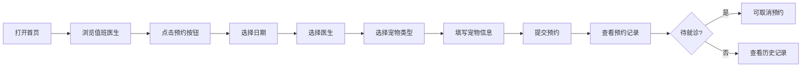

## 1. 产品概述

宠物医院线上预约挂号系统，为宠物主人提供便捷的在线挂号服务，解决传统电话挂号效率低、信息不透明的问题。目标用户为养宠人士，核心价值是实现预约流程线上化，提升就医体验。

## 2. 核心功能

### 2.1 用户角色

| 角色 | 注册方式 | 核心权限 |
|------|----------|----------|
| 宠物主人 | 无需注册（访客模式） | 浏览医生、提交预约、查看预约记录 |

### 2.2 功能模块

1. **首页（医生列表）**：顶部导航、今日值班医生卡片列表、剩余号源展示
2. **预约表单**：日期选择、医生选择、宠物类型选择、信息填写、提交预约
3. **预约记录**：历史挂号列表、状态标签（待就诊/已完成/已取消）

### 2.3 页面详情

| 页面名称 | 模块名称 | 功能描述 |
|----------|----------|----------|
| 首页 | 医生卡片 | 展示医生头像、姓名、擅长科室、今日剩余号源数量 |
| 首页 | 号源提示 | 用不同颜色标识号源充足/紧张/已满 |
| 预约表单 | 日期选择器 | 选择预约日期，默认今天 |
| 预约表单 | 医生选择 | 下拉选择对应日期值班的医生 |
| 预约表单 | 宠物类型 | 单选：猫、狗、兔子、异宠 |
| 预约表单 | 信息填写 | 宠物姓名、主人电话、病情描述 |
| 预约记录 | 状态标签 | 三种状态不同配色标识 |
| 预约记录 | 取消操作 | 待就诊状态可取消预约 |

## 3. 核心流程

用户打开首页 → 浏览今日值班医生 → 点击「预约」进入表单 → 选择日期/医生/宠物类型 → 填写信息提交 → 跳转预约记录查看 → 可取消待就诊预约

## 4. 用户界面设计

### 4.1 设计风格

- **主色调**：浅绿色系（#86efac 为主，#22c55e 为强调色）
- **背景色**：纯白色（#ffffff），卡片浅灰底色（#f9fafb）
- **按钮风格**：圆角胶囊型，浅绿填充，hover 深绿
- **字体**：无衬线字体，标题 18px 粗体，正文 14px 常规
- **布局风格**：卡片式布局，圆角 12px，柔和阴影
- **图标风格**：线性简洁图标，与浅绿主题呼应

### 4.2 页面设计概述

| 页面名称 | 模块名称 | UI 元素 |
|----------|----------|---------|
| 首页 | 医生卡片 | 圆形头像、姓名标签、科室标签、号源数字徽章、预约按钮 |
| 首页 | 顶部导航 | 医院 Logo、「今天值班」标题、日期显示 |
| 预约表单 | 表单区域 | 分段选择器、下拉框、输入框、提交按钮 |
| 预约记录 | 记录卡片 | 预约编号、医生姓名、预约时间、状态标签 |
| 全局 | 底部 Tab | 三个图标+文字切换，激活态浅绿背景 |

### 4.3 响应性

- **移动端优先**：375px 基准设计，使用百分比和弹性布局
- **断点适配**：768px 以下单栏，768px 以上最多两栏卡片
- **触摸优化**：按钮最小高度 44px，点击区域充足
- **安全区适配**：底部 Tab 栏适配 iPhone 安全区

