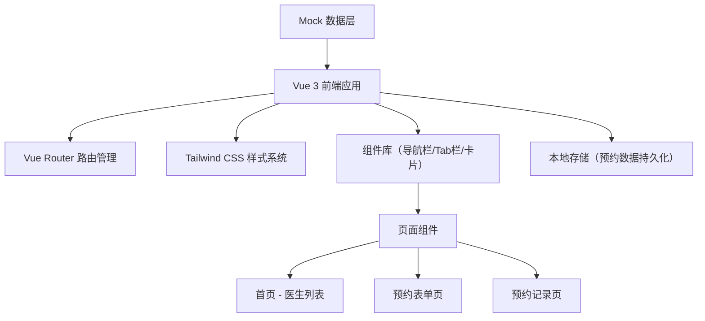
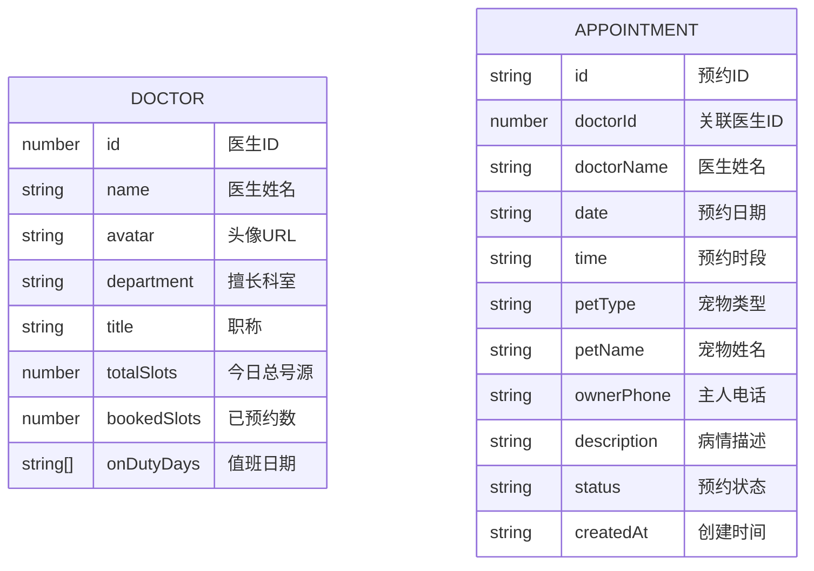

## 1. 架构设计



## 2. 技术描述

- **前端框架**：Vue 3 + TypeScript + Composition API
- **初始化工具**：vite-init
- **路由管理**：Vue Router 4
- **样式方案**：Tailwind CSS 3
- **状态管理**：Vue 响应式 API + localStorage 持久化
- **数据方案**：前端 Mock 数据，无需后端

## 3. 路由定义

| 路由 | 页面 | 说明 |
|------|------|------|
| `/` | 首页（医生列表） | 默认路由，展示今日值班医生 |
| `/appointment` | 预约表单 | 选择日期、医生、宠物类型并提交 |
| `/records` | 预约记录 | 展示历史预约及状态 |

## 4. 数据模型

### 4.1 数据模型定义



### 4.2 TypeScript 类型定义

```typescript
// 医生类型
interface Doctor {
  id: number
  name: string
  avatar: string
  department: string
  title: string
  totalSlots: number
  bookedSlots: number
  onDutyDays: string[]
}

// 宠物类型枚举
type PetType = 'cat' | 'dog' | 'rabbit' | 'exotic'

// 预约状态枚举
type AppointmentStatus = 'pending' | 'completed' | 'cancelled'

// 预约记录类型
interface Appointment {
  id: string
  doctorId: number
  doctorName: string
  date: string
  time: string
  petType: PetType
  petName: string
  ownerPhone: string
  description: string
  status: AppointmentStatus
  createdAt: string
}

// 预约表单类型
interface AppointmentForm {
  date: string
  doctorId: number | null
  petType: PetType | null
  petName: string
  ownerPhone: string
  description: string
}
```

## 5. 项目结构

```
src/
├── components/          # 公共组件
│   ├── AppHeader.vue    # 顶部导航栏
│   ├── AppTabBar.vue    # 底部 Tab 栏
│   ├── DoctorCard.vue   # 医生卡片
│   └── StatusTag.vue    # 状态标签
├── pages/               # 页面组件
│   ├── Home.vue         # 首页 - 医生列表
│   ├── Appointment.vue  # 预约表单
│   └── Records.vue      # 预约记录
├── types/               # 类型定义
│   └── index.ts
├── data/                # Mock 数据
│   └── mock.ts
├── utils/               # 工具函数
│   └── storage.ts       # 本地存储工具
├── router/              # 路由配置
│   └── index.ts
├── App.vue              # 根组件
├── main.ts              # 入口文件
└── style.css            # 全局样式
```

## 6. 核心功能实现要点

1. **号源计算**：`remainingSlots = totalSlots - bookedSlots`，根据剩余数量判断号源状态
2. **医生排班**：根据选择日期筛选当天值班医生
3. **本地存储**：使用 localStorage 存储预约记录，页面刷新不丢失
4. **状态管理**：使用 Vue 3 `reactive` 管理表单状态和预约列表
5. **移动端适配**：使用 Tailwind 响应式类，`max-w-md` 居中容器

